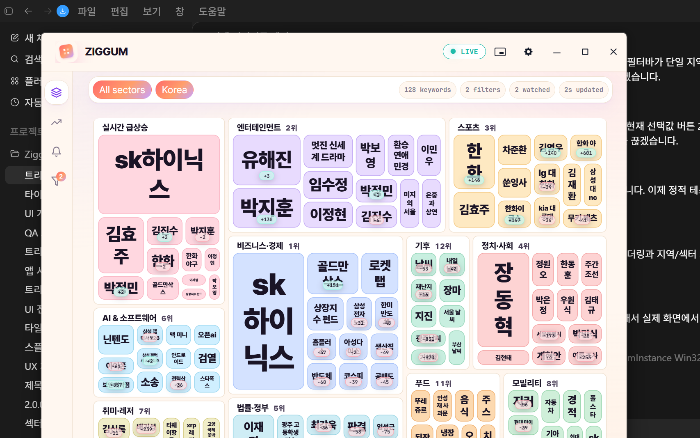
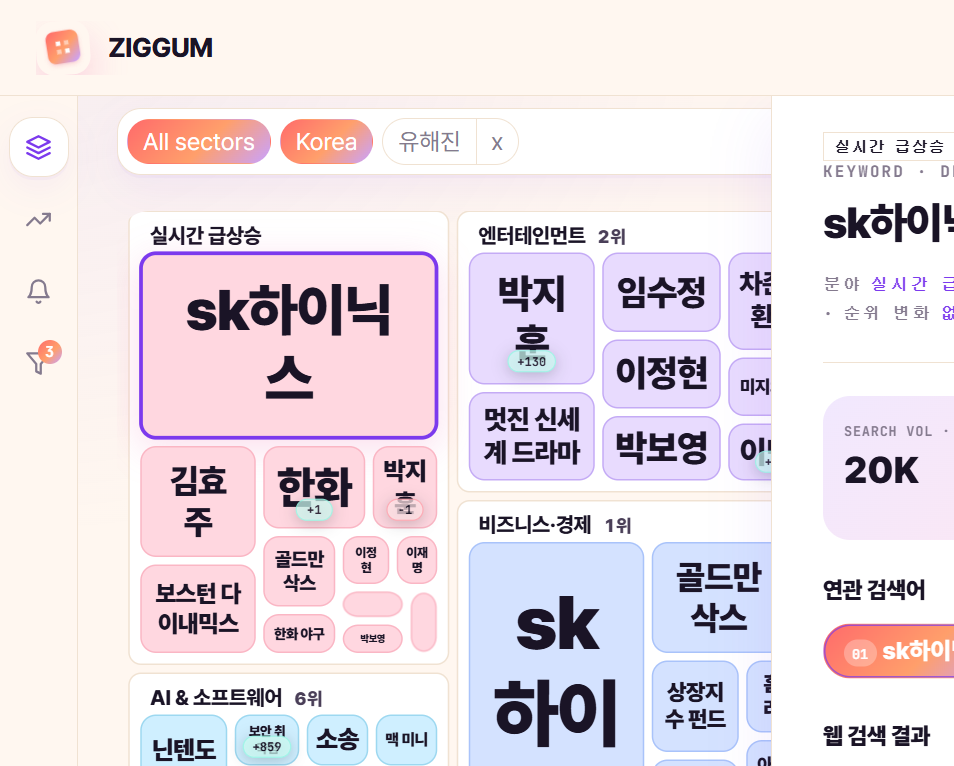
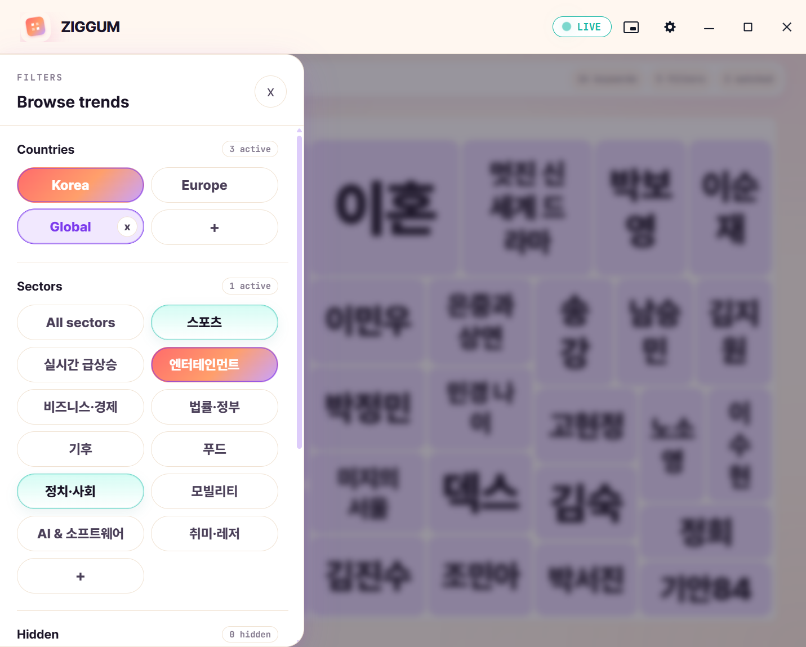

# Ziggum

**지금 사람들이 무엇을 검색하는지, 한눈에 파악하세요.**

---

Ziggum은 Google 실시간 검색 트렌드를 **한 화면에 펼쳐 보여주는** Windows 앱입니다.
지금 이 순간 가장 많이 검색되는 키워드가 크기순으로 정렬되어, 트렌드를 한눈에 읽을 수 있습니다.

---

## 이런 분께 딱 맞습니다

- **콘텐츠 크리에이터 / 마케터** — 지금 뜨는 소재를 바로 캐치하고 싶은 분
- **트렌드 체크가 일상인 분** — 뉴스 앱 여러 개 대신 트렌드만 빠르게 훑고 싶은 분
- **SNS·커머스 운영자** — 실시간 화제 키워드로 게시물·광고 소재를 찾는 분

---

## 주요 기능

### 실시간 트렌드 한눈에 보기

검색량이 많을수록 타일이 크게, 카테고리마다 색이 달라서 지금 어느 분야가 뜨겁는지 색상만 봐도 알 수 있습니다.
30초마다 자동으로 새로고침되어 항상 최신 트렌드를 보여줍니다.

---

### 키워드 클릭 → 상세 정보 즉시 확인

궁금한 키워드를 클릭하면 오른쪽에 상세 패널이 열립니다.
연관 검색어, 관련 뉴스, 웹 검색 결과까지 앱 안에서 바로 볼 수 있습니다.

---

### 카테고리 필터 & 순서 변경

뉴스, 연예, 스포츠, 게임 등 **13개 카테고리**를 원하는 대로 켜고 끌 수 있습니다.
자주 보는 카테고리를 위로 드래그해 나만의 배치를 만들 수 있습니다.

---

### 기간 선택

- **실시간** — 지금 이 순간 급상승 중인 키워드
- **24시간** — 오늘 하루 가장 많이 검색된 키워드
- **7일** — 이번 주 트렌드 전체

---

## 설치 방법

### [⬇ 최신 버전 다운로드](../../releases/latest)

1. 위 링크에서 `Ziggum-Setup-x.x.x.exe` 파일을 받습니다
2. 파일을 실행하고 설치를 완료합니다
3. Ziggum을 열면 바로 실시간 트렌드가 표시됩니다

> 새 버전이 나오면 앱이 **자동으로 업데이트**됩니다. 따로 재설치할 필요가 없습니다.

**지원 환경:** Windows 10 / 11 (64-bit)

---

## 자주 묻는 질문

**Q. 인터넷 연결이 필요한가요?**
네, 실시간 트렌드 데이터를 불러오기 때문에 인터넷 연결이 필요합니다.

**Q. 데이터는 어디서 가져오나요?**
Google 검색 트렌드 데이터를 기반으로 합니다.

**Q. 무료인가요?**
네, 완전 무료입니다.

---

## 라이선스

MIT
